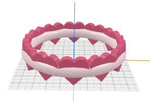
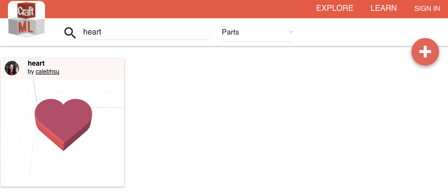
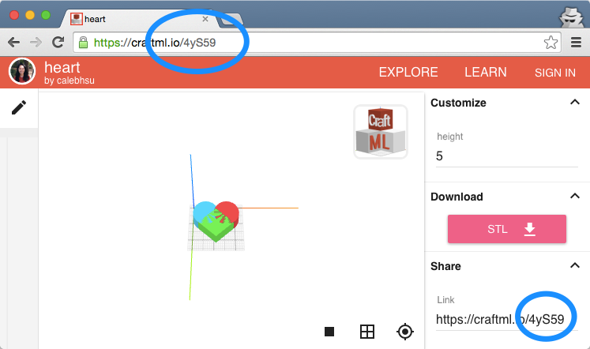
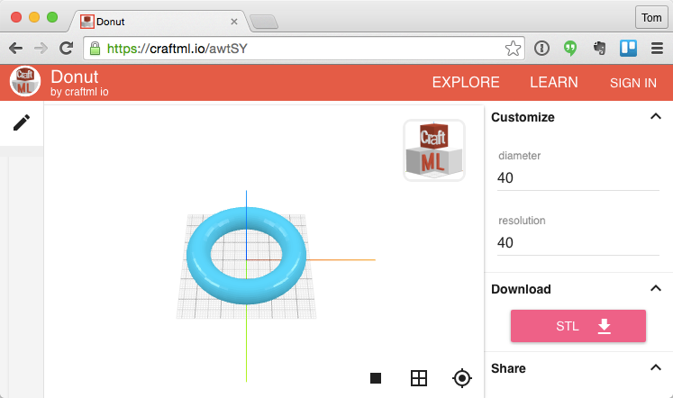

# How to Craft a Bracelet?

Let's build a bracelet of hearts!

One key feature of CraftML is its highly extensible module system.
Any model made using CraftML can be shared on [craftml.io](https://craftml.io)
and become immediately available to be imported into and used by another model.

Instead of coding up everything from scratch to make this bracelet,
let's see how we can rely on external modules to (1) generate 12 hearts, (2)
generate a ring, and (3) arrange the hearts around the ring.

### Step 1: 12 Hearts

Using the search function of [craftml.io](https://craftml.io), we can lookup a
heart model we want.

Let's take a look at this heart model in the search result.

It is made by the user [calebhsu](https://craftml.io/user/github:9546162).
Every 3D model on [craftml.io] has a unique module id. This heart model's id is
`4yS59`. This is the id we can use to import this heart into our own design.
we want to import `4yS59` and call it `foo`. We write `<foo module="4yS59">`.
`foo` can be any name we want. But it is usually a good idea to choose a
meaningful and descriptive name, such as `heart`.


<heart module="4yS59" repeat="12"/>


### Step 2: Ring

If you've gone through the other tutorials, by now you should probably be
able to craft your own ring. But let's just find one we can import to save time.
One good option is the __donut__ module at [https://craftml.io/awtSY](https://craftml.io/awtSY).

When we import this model, we can call it anything we like. Naming it `ring` would
be more appropriate in our case. Notice that there are two parameters we can
set to customize this ring (or donut): `diameter` and `resolution`. We
set the `diameter` to 80.


<heart module="4yS59" repeat="12"/>
<ring module="awtSY" diameter="80"/>


### Step 3: Layout

The last step is to arrange the 12 hearts around
the ring. Let's see if there's an existing layout module that will do this
for us. By browsing the gallery on [craftml.io](https://craftml.io),
the __Sun Layout__ module at [https://craftml.io/uHUIw](https://craftml.io/uHUIw)
looks like the one we need. Its
module ID is `uHUIw`. It has a `radius` parameter. It takes all the elements
inside the tag and arranges them around a circle of that radius. We set
the `radius` to 40 in order to match the ring's diameter, which is 80.


<sun-layout module="uHUIw" radius="40">
  <heart module="4yS59" repeat="12"/>
</sun-layout>
<ring module="awtSY" diameter="80"/>


Still not quite right because the hearts are lying down on the ground plane.
We need to rotate them to the right orientation ({{ 'rotate' | t}} ).


<sun-layout module="uHUIw" radius="40">
  <heart module="4yS59" repeat="12"
    t="rotate x 90; rotate z 90"/>
</sun-layout>
<ring module="awtSY" diameter="80"/>


Finally, let's do some centering and styling. Here's our bracelet!


<g l="centerZ()">
  <sun-layout module="uHUIw" radius="40">
    <heart module="4yS59" repeat="12"
      t="rotate x 90; rotate z 90"/>
  </sun-layout>
  <ring module="awtSY" diameter="80"/>
</g>

