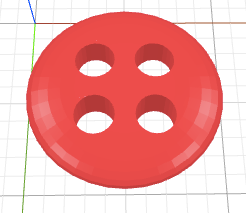
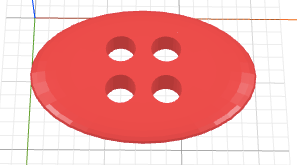
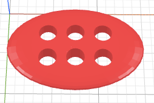
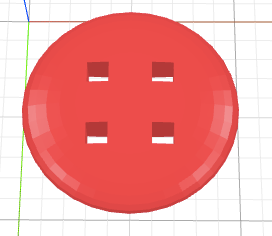
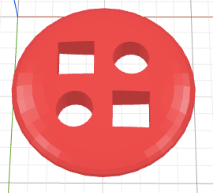

# How to Craft a Button?

The objective of this tutorial is to craft a button with four holes like below.

First, notice that the body of button looks like a flatten pizza dough. We
use a {{ 'sphere' | tag }} tag to create a ball, like a ball of pizza dough before it was flatten.
By default, a sphere as a size of 10 by 10 by 10. To flatten this sphere, one
approach is to reduce the size of this sphere along the z-axis. To do so, we
use the transform command {{ 'size' | t }}, which transforms its size so that the
z dimension has the size of 2, while scaling the other two dimensions
proportionally to keep its aspect ratio.


<sphere t="size z 2"/>


Next we need to do is to drill holes. To achieve this, we create four cylinders
({{ 'cylinder' | tag }}) that will be used to cut through the body of the button. These cylinders
need to be positioned at the four corners of the squares. To do so, we use
the transform command {{ 'position' | t }} to change to position of the cylinder to
the desired locations. Because later we will want to move these cylinders as a group,
we use a {{ 'g' | t }} tag to group them.


<g>
  <cylinder radius="1" t="position 0 0 0"/>
  <cylinder radius="1" t="position 0 3 0"/>
  <cylinder radius="1" t="position 3 0 0"/>
  <cylinder radius="1" t="position 3 3 0"/>
</g>


We bring all the parts together, but they are not aligned correctly.

<sphere t="size z 2"/>
<g>
  <cylinder radius="1" t="position 0 0 0"/>
  <cylinder radius="1" t="position 0 3 0"/>
  <cylinder radius="1" t="position 3 0 0"/>
  <cylinder radius="1" t="position 3 3 0"/>
</g>


What we want is to center the cylinders with respect to the center of the button.
To do so, we use the layout command {{ 'center' | l }}.


<g l="center xy">
  <sphere t="size z 2"/>
  <g>
    <cylinder radius="1" t="position 0 0 0"/>
    <cylinder radius="1" t="position 0 3 0"/>
    <cylinder radius="1" t="position 3 0 0"/>
    <cylinder radius="1" t="position 3 3 0"/>
  </g>
</g>


Now that we are satisfied with where the cylinders are, we cut them. We use
the transform command {{ 'cut' | t }} and use the tag name
directly as the argument (i.e., `cut cylinder`).


<g l="center xy; cut cylinder">
  <sphere t="size z 2"/>
  <g>
    <cylinder radius="1" t="position 0 0 0"/>
    <cylinder radius="1" t="position 0 3 0"/>
    <cylinder radius="1" t="position 3 0 0"/>
    <cylinder radius="1" t="position 3 3 0"/>
  </g>
</g>


Congraulations! You've crafted a button.

## Exercises

1. A button with an oval shape

  

2. A button with an oval shape and six holes

  

3. A button with square holes

  

3. A button with a mixture of square and round holes

  
