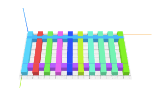
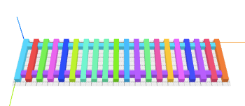
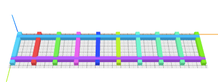
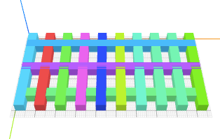

# How to Craft a Fence?

The objective of this tutorial is to craft a fence that looks like below.

One way to construct this fence is to decompose it into three steps:
1. build a row of evenly spaced vertical sticks
2. build two long sticks running across horizontally
3. position (1) and (2) in the way we want

## Step 1

To create a vertical stick, we can use a {{'cube' | tag}} and set its size
to `5 50 5`, which is `5` units
along the x-axis, `50` units along the y-axis, and `5` units along the z-axis.
By default, one unit is equal to one _mm_.


<cube size="5 50 5"/>


Add the {{'repeat' | tag}} attribute to the cube tag and set its value to `10`, which will give
us 10 copies of this vertical stick.


<cube repeat="10" size="5 50 5"/>


However, all these 20 sticks are overlapping. To put them in a row with even
spacing, we can wrap them inside a  {{'row' | tag}} tag and set the `spacing` attribute
to `5` to add a spacing of 5 units between every two sticks.


<row spacing="5">
  <cube repeat="10" size="5 50 5"/>
</row>


## Step 2

The next step is to build two long sticks. Similarly, we can create a {{'cube' | tag}} and
set its `size` and `repeat` attributes to what we want. Then, to position
the two sticks, we can use a {{'col' | tag}} tag, which is like a {{'row' | tag}} except
items are lined up along the y-axis.


<col spacing="30">
  <cube repeat="2" size="90 5 5"/>
</col>


## Step 3

Finally, we can bring the two parts together. We also want to align the
two parts correctly. To do so, we group them using {{'g' | tag}} and use the
layout command {{'center' | l}}.



<g l="center y">

  <!-- a row of 10 sticks -->
  <row spacing="5">
    <cube repeat="10" size="5 50 5"/>
  </row>

  <!-- a column of 2 sticks -->
  <col spacing="30">
    <cube repeat="2" size="95 5 5"/>
  </col>

</g>



## Exercises

Can you build these other kinds of fences?

1. A fence with 20 posts

  

2. A fence with wider gaps between posts

  

3. A fence with three horizontal sticks

  
