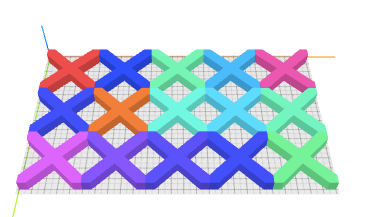
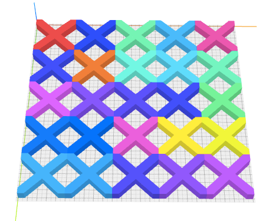
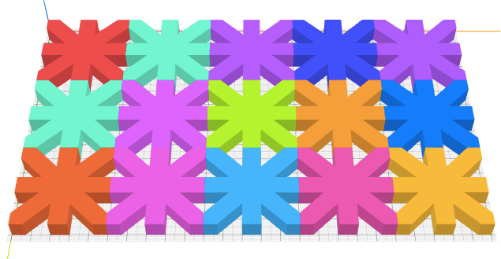
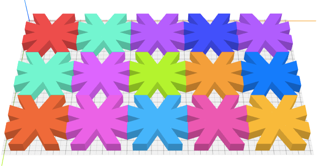

# How to Craft a Lattice?

The objective of this tutorial is to craft a lattice.

The concepts covered in this tutorial include:
* {{ 'rotate' | t }}
* {{ 'clip' | t }}
* {{ 'part' | tag }}

This lattice is a 3 by 5 grid of tiles, where each tile is an X.

First, create an X pattern using two elongated cubes crossing each other.
Each cube's size is set to `100 10 10` and is rotated using the transform
command {{ 'rotate' | t }} with `z 45` and `z -45` respectively as the arguments.
The letter `z` indicates that rotation is
performed around the z-axis. The amount of rotation is 45 degrees and -45 degrees
for the two cubes respectively.


<cube size="100 10 10" t="rotate z 45"/>
<cube size="100 10 10" t="rotate z -45"/>


Ideally, we want each tile to be shaped like a square with right-angle corners.
But it is not the case right now. One easy way to force the tile to take on
a square shape is to simply add another cube to say how this square should
look like. We use {{ 'center' | t }} to align this square to the center of the cross.


<g l="center xy">
  <cube size="50 50 10" id="square"/>
  <cube size="100 10 10" t="rotate z 45"/>
  <cube size="100 10 10" t="rotate z -45"/>
</g>


The transform command {{ 'clip' | t }} is useful for clipping a solid to the spaces inside
selected objects. Here, we wish to clip it to inside the first square cube.
We assign an id to the square cube `id="square"`.
Then, we can write `clip #square` to select this square cube and remove
everything except for the portions inside the square.


<g l="center xy" t="clip #square">
  <cube size="50 50 10" id="square"/>
  <cube size="100 10 10" t="rotate z 45"/>
  <cube size="100 10 10" t="rotate z -45"/>
</g>


We wrap the code above with a {{ 'part' | tag }} tag and set its name to `tile`. This
allows us to use `<tile>` later each time we wish to generate a tile model,
instead of writing the same code again. This greatly improves reusability.
Another benefit of using a {{ 'part' | tag }} tag is to improve readability. In the code
below, it is not hard to understand the code is meant to create a row of
five tiles.


<part name="tile">
  <g l="center xy" t="clip #square">
    <cube size="50 50 10" id="square"/>
    <cube size="100 10 10" t="rotate z 45"/>
    <cube size="100 10 10" t="rotate z -45"/>
  </g>
</part>

<row>
  <tile/>
  <tile/>
  <tile/>
  <tile/>
  <tile/>
</row>


Finally, we add `repeat="3"` to {{ 'rotate' | t }} to repeat this row three times.
See {{ 'repeat' | attr }} for more details how it works.Finally, we
wrap the repeated rows with a {{ 'col' | tag }} to arrange the resulting three rows in a
column along the y-axis. We are done!


<part name="tile">
  <g l="center xy" t="clip #square">
    <cube size="50 50 10" id="square"/>
    <cube size="100 10 10" t="rotate z 45"/>
    <cube size="100 10 10" t="rotate z -45"/>
  </g>
</part>

<col>
  <row repeat="3">
    <tile/>
    <tile/>
    <tile/>
    <tile/>
    <tile/>    
  </row>
</col>


## Exercises

1. A lattice of 5 by 5 tiles

  

4. A lattice where the two strokes of the X cross at a wider angle.

  

4. A lattice where each tile has four lines.

  

4. A lattice where each tile has four lines.

  
