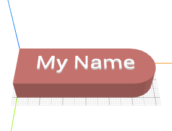

# How to Craft a Name Tag?

Name tags are by far the most frequently printed 3D objects. It is very easy
to design a name tag using CraftML. Let's see how to build one like below.

This name tag can be broken down into two parts: the _tag_ part and the _name_
part. The _tag_ part has a shape that looks like a rectangle and a
semi-circle joined together. After decomposing the model into individual parts
like this, we can proceed to model them individually and assemble them later.

First, lets model the _tag_ part. We need a rectangle and a semi-circle.
For the rectangle, we use {{ 'cube' | tag}}  and give it a size sufficiently large to hold
the text later. For the semi-circle, we use {{ 'cylinder' | tag}}  and specify
a radius of 10 to match the rectangle's dimension in y. Then, we use
the transform command {{ 'crop' | t}}  to crop the first 50% of the cylinder
along the x-axis, which gives us the semi-circle we want.


<row>
  <cube size="50 20 10"/>
  <cylinder radius="10" t="crop x min 50%"/>
</row>


Next, the _name_ part. CraftML lets us write text-oriented contents simply
by writing HTML tags, as if we are developing a web page. Here, we use a
{{ 'div' | tag}}  tag and put a name in it.



My Name



After the two parts are ready, we arrange them in a stack.


<part name="tag">
  <row>
    <cube size="50 20 10"/>
    <cylinder radius="10" t="crop x min 50%"/>
  </row>
</part>
<part name="name">
  
My Name

</part>
<stack>
  <name/>
  <tag/>
</stack>


Finally, we can style the name tag so that it looks pretty!


<part name="tag">
  <row>
    <cube size="50 20 10"/>
    <cylinder radius="10" t="crop x min 50%"/>
  </row>
</part>
<part name="name">
  
My Name

</part>
<stack>
  <name/>
  <tag/>
</stack>

