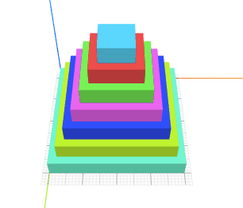

# How to Craft a Pyramid?

The objective of this tutorial is to build a pyramid made of a stack of
square-shaped bricks of decreasing size from bottom to up.

First, create a square-shaped brick using the {{'cube' | tag}} primitive.
We set the size of the cube to `10 10 5`. It is the smallest piece
that will be the tip of the pyramid.


<cube size="10 10 5"/>


Next, create the next piece to go underneath this top piece. This piece
should be larger than the top piece. Let's set the size to `15 15 5`.


<cube size="10 10 5"/>
<cube size="15 15 5"/>


The two pieces are overlapping because they are both positioned at `(0,0,0)`.
We can wrap the two with a {{'stack' | tag}} tag to put one on top of the other.


<stack>
  <cube size="10 10 5"/>
  <cube size="15 15 5"/>
</stack>


To make the pyramid taller, continue to add more cubes with increasing
sizes to the bottom of the stack.


<stack>
  <cube size="10 10 5"/>
  <cube size="15 15 5"/>
  <cube size="20 20 5"/>
  <cube size="25 25 5"/>
  <cube size="30 30 5"/>
  <cube size="35 35 5"/>
  <cube size="40 40 5"/>
</stack>

