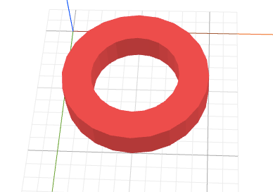
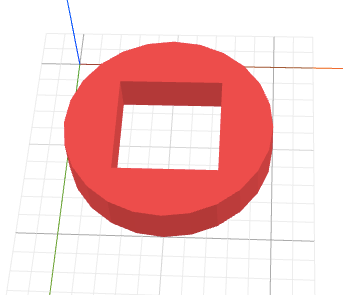
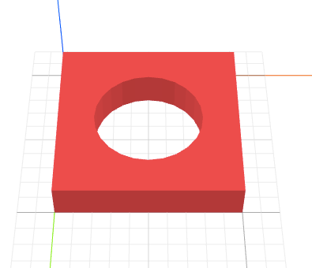
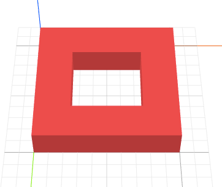

# How to Craft a Washer?

The objective of this tutorial is to build a flat washer like below, which
looks like a flat disk with a circular hole inside.

We will use
* {{ 'cylinder' | tag }}
* {{ 'g' | tag }}
* {{ 'cut' | t }}
* {{ 'center' | l }}
* `id="hole"`

## Steps

First, create a flat disk using the {{ 'cylinder' | tag}} primitive. Set the height
of this cylinder to `2`. We can set the height to an even smaller value to
make the disk thinner.


<cylinder height="2"/>


Next, create a smaller flat disk with the height. By default, a cylinder has a
radius of `5`. So we set this second cylinder's radius to `3` so that it is smaller
than the previous cylinder. The purpose of this smaller disk is to mark the region
we want to cut out of the bigger disk later.


<cylinder height="2"/>
<cylinder radius="3"/>


We want to center the two disks. We can accomplish this by grouping the two by
a `<g>` tag with a layout command {{ 'center' | l}} to center them
along the x and y axes.


<g l="center xy">
  <cylinder height="2"/>
  <cylinder radius="3"/>
</g>


Now that the two disks are positioned in the way we want, we can cut the second,
smaller disk from the bigger one using the transform command {{ 'cut' | t}}. To indicate
it's the second cylinder we really want to cut, we assign an `id` to that cylinder
by `id="hole"`. Then, we can give `#hole` as an argument to the cut command
like `cut #hole`. Note that `#something` is just a standard css selector for selecting
elements whose id is `something`.


<g l="center xy" t="cut #hole">
  <cylinder height="2"/>
  <cylinder radius="3" id="hole"/>
</g>


## Exercises

Can you apply what you've learned to craft the following objects?

1. A round washer with a rectangular hole

  

2. A rectangular washer with a round hole

  

3. A rectangular washer with a rectangular hole

  
